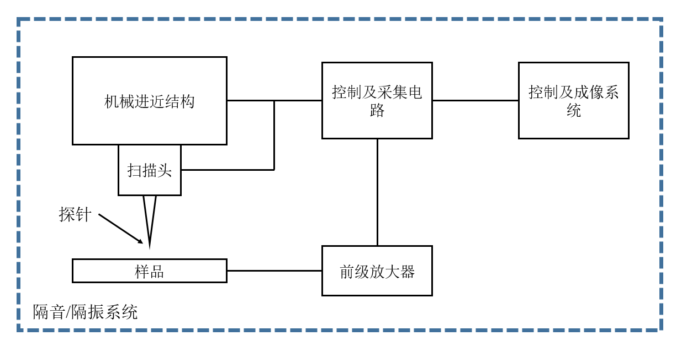

# STM基本结构

## 整体结构

        扫描隧道显微镜的整体结构如图所示，其主要部件包括：机械进近结构、扫描头、探针、样品、前级放大器、控制及采集电路、控制及成像系统、隔音/隔震系统。

## 机械进近结构

        机械进近结构负责将探针与样品进近到隧穿距离内，通常这个距离在1纳米左右。为了实现如此小尺度的进近，比较广泛的解决方案是利用机械结构设计进行位移的比例缩放[1]，通过将较大的位移缩放为小尺度的位移，从而实现精细移动。

        对于机械结构的控制，通常会引入步进电机作为位移驱动器。但是步进电机的使用会额外引入热噪声，为了避免热漂移问题，目前最合适作为STM的位移驱动器马达是粘-滑压电马达。

## 扫描头

        在机械进近结构将探针进近到隧穿距离后，扫描头将负责控制探针进行X、Y、Z轴移动，对样品表面进行扫描，并且扫描头的位移精度决定了最终成像的图像精度。为了实现微小位移，目前，以锆钛酸铅为主要成分的压电陶瓷（PZT）被广泛被应用与扫描隧道显微镜的扫描头中。由于逆压电效应，通过对压电陶瓷施加电压，压电陶瓷产生的位移将可以带动探针实现纳米级的X、Y、Z轴移动。

## 探针

        对于扫描隧道显微镜而言，隧穿电流最好由探针针尖的单个原子进行拾取，故需要原子级尖锐的针尖。对于针尖的制备，通常会选择金、铂等不易氧化的惰性材料进行电解制备而成[2]。但根据Nano Surf公司生产的STM技术资料以及普渡大学的资料显示，使用剪线钳对金属丝进行拉伸式剪切所得到的探针同样能够实现原子级分辨率。

## 前级放大器

        由于隧穿电流通常在纳安数量级，故需要前级放大器对该数量级下的隧穿电流进行信号放大处理。在扫描隧道显微镜中，通常采用基于运算放大器的跨阻放大器[3]将隧穿电流信号转换为数字信号。

## 控制及采集电路

        控制及采集电路主要负责控制机械进近结构进行进近、控制扫描头进行图像扫描以及采集前级放大器放大后的隧穿电流信号。通常控制及采集电路需要包括数模、模数转换器以及电机控制器。

## 控制及成像系统

        控制及成像系统通常为运行在计算机上的能够与用于进行交互的程序。用户通过程序向控制电路发送信号，完成对样品的图像扫描头，通过程序内部的图像转换程序实现隧穿电流对可视化图像的转换。

## 隔音、隔震系统

        由于扫描隧道显微镜的成像尺度在原子级，故对机械震动以及声波震动的敏感性极高，故需要搭建隔音、隔震系统保证扫描隧道显微镜工作在最佳环境。

# 参考文献

[1].    Grafstrom S, Kowalski J, Neumann R. Design and detailed analysis of a scanning tunnelling microscope[J]. Measurement Science and Technology, 1990, 1(2): 139.

[2].    Nam A J, Teren A, Lusby T A, et al. Benign making of sharp tips for STM and FIM: Pt, Ir, Au, Pd, and Rh[J]. Journal of Vacuum Science & Technology B: Microelectronics 

[3].    Petersen J P, Kandel S A. Circuit design considerations for current preamplifiers for scanning tunneling microscopy[J]. 2017.

