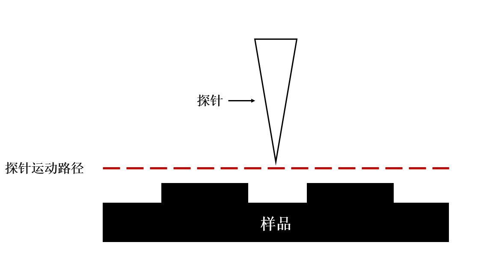
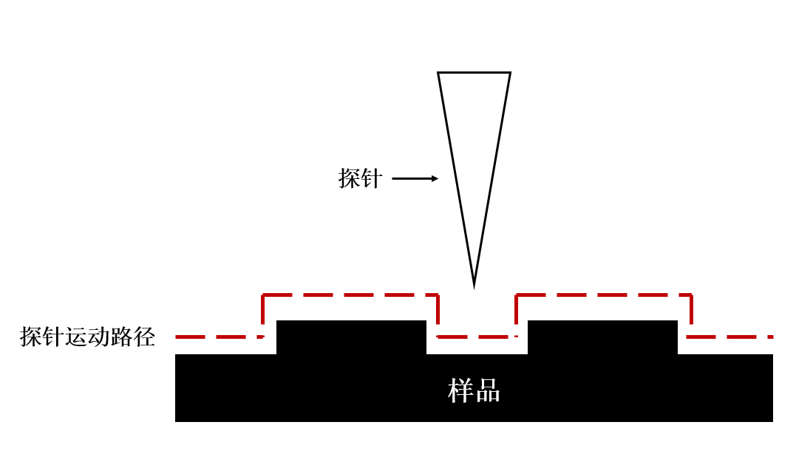

# 扫描隧道显微镜工作模式

## 恒高扫描模式

        在恒高扫描模式中，扫描头的Z轴的高度将固定，通过控制X、Y轴的移动完成对样品表面的扫描，其扫描路径如图所示。在该模式下，样品的形貌变化通过隧穿电流变化体现，当隧穿电流变大时，表示样品表面存在突起，当隧穿电流减小时，表示样品表面存在凹陷。但由于样品表面的平整性不能完全保证，若样品表面某处存在大于探针悬停距离（隧穿距离）的突起时，探针在扫描该处时将与突起碰撞，从而导致探针针尖损毁。

## 恒流扫描模式

        在恒流扫描模式中，扫描头在对X、Y轴扫描的过程中，将控制探针Z轴的高度使隧穿电流大小恒定，即在扫描过程中探针与样品间距离保持恒定，Z轴运动轨迹呈现为贴合样品形貌起伏进行扫描，如图所示。扫描路径在扫描完成后通过分析Z轴位置信息将可以得出样品表面的形貌状态。在扫描隧道显微镜扫描的过程中通常会选择恒流扫描模式，以避免针尖损毁的情况发生。

