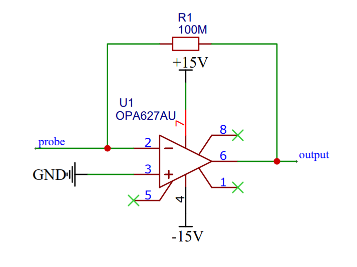
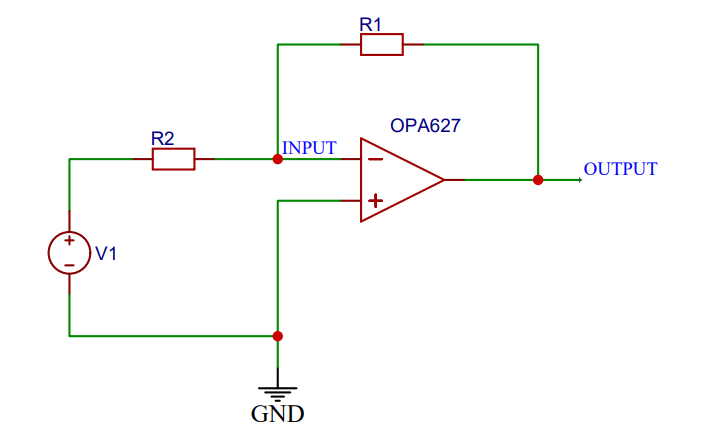
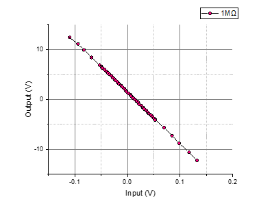

## 前级放大器设计

        隧穿电流大小在100pA~10nA[1]区间，故需要前级放大器具备可观的电流放大能力。本项目采用运算放大器（运放）作为核心放大元件，通过搭配反馈电阻构成跨组放大器对隧穿电流进行放大。

        图上为前级放大器的简化原理图，运放型号为德州仪器公司生产的OPA627，反馈电阻阻值为100×10^6 Ω即100MΩ。在选择运算放大器时主要关注输入偏置电流参数：OPA627的输入偏置电流典型值为1pA，即大小为隧穿电流最小值的1/100，偏置电流大小与最小隧穿电流大小相差两个数量级，满足对隧穿电流的测量条件。
        通过如图所示电路可以将端口probe处输入的隧穿电流转换电压信号在端口output处输出。通过运算放大器的特性可知，前级放大器的电流-电压转化公式为（其中，U_out为前级放大器的输出电压，R_1为反馈电阻阻值，I_Tunneling为隧穿电流，方向定义为从端口probe处流入）：

$$
U_{out}=-R_1 I_{Tunneling}
$$

        即电流-电压放大倍数由反馈电阻R1直接决定，在上图中，R1阻值为100MΩ，即放大倍数为10^8倍。可认为当存在10nA大小的隧穿电流输入至输入端时，该电流将被放大为-1V的电压在输出端输出。

# 放大性能简易验证

        可变电压源V1经过阻值与R_1接近的大电阻R_2（范围在1MΩ~100MΩ）接入前级放大器的输入端，产生小电流。通过运算放大器的虚地特性可知，当运放的同相输入端接地时，反相输入端的电位也同时为地，则如图所示的测试电路中的前级放大器的输入电流可由公式(3.2)计算（其中U_V1为可变电压源输出电压，R_2为电阻阻值）：

$$
I_{INPUT}=\frac{U_{V1}}{R_2}
$$

        结合前级放大器的转换公式(3.1)，则此时可变电压源V1输出电压与前级放大器输出电压间的关系应为（其中R_1为前级放大器的反馈电阻阻值）：

$$
U_{OUTPUT}=-R_1×\frac{U_{V1}}{R_2}
$$

        若前级放大器性能良好，则在改变可变电压源V1的电压时，前级放大器的输出电压值应始终满足上述公式并拥有良好的线性度。
        在放大器性能验证中，测试将分为两组：两组测试的R_1均被设置为误差为±5%的100MΩ电阻，两组测试的R_2被分别设置为误差为±5%，阻值为1MΩ、100MΩ的电阻。测试将对可变电压源输出电压-前级放大器输出电压曲线进行测量，测量仪器为RIGOL-DS1102型示波器，测试结果如下：

# 参考资料

[1].    Ellis M D. Construction of a scanning tunneling microscope for imaging of carbon nanotubes[D]. Texas Tech University, 1998.
