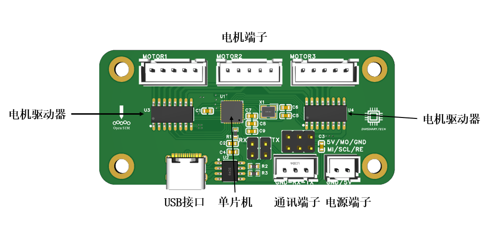
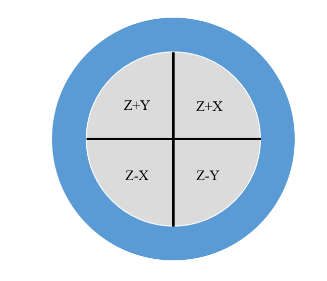
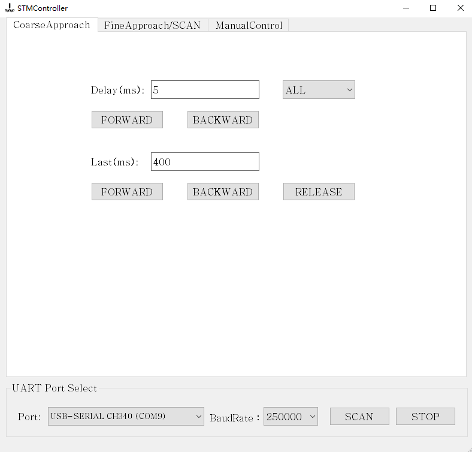
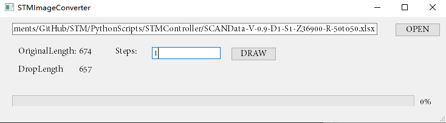

# 控制电路设计

## 系统结构总览

        显微镜的数字控制系统框图如图所示。在显微镜工作时，由上位机（电脑）运行的软件通过串口与主控制器进行通讯，完成对显微镜的所有控制与数据采集工作。
        主控制器负责控制三个对象：步进电机控制器、数模转换器（DAC）、模数转换器（ADC）。主控制器通过串口控制步进电机控制器完成对步进电机的驱动，通过SPI通讯协议控制数模转换器完成对扫描头的压电控制，通过SPI协议接收数模转换器采样的前级放大器数据。

## 主控制器

        由于ESP32单片机具有双核心高速处理器、多个硬件SPI接口、两个硬件串口，能够非常好地满足本项目对于主控制器的条件，故主控制器使用ESP32作为核心处理单元。主控制器与电源芯片集成在同一块控制PCB上，电源芯片为步进电机控制器以及数模、模数转换器提供电源。

        （1）交互接口方面，控制PCB上的USB接口用于与上位机进行串口通讯，为保证传输速率，波特率为250000。数模、模数转换器接口用于与数模、模数转换器的供电与数据交换，步进电机控制器接口用于与并不仅电机控制器的供电与数据交换。

        （2）电源设计方面，控制PCB一共设计了两组电源：用于模拟电路用途的电源以及用于数字用途的电源，两组电源由分立的锂电池进行供电，并且两组电源电路的大地进行了隔离以减少噪音耦合。

        对于数字用途的电源，其包括5V和3.3V两个电源平面，5V电源平面由普通的开关升压芯片将锂电池3.7V电压升压至5V，用于对步进电机驱动器的供电。3.3V电源平面由低压差线性稳压器（LDO）将锂电池电压降压至3.3V，用于ESP32单片机的供电。

        对于模拟用途的电源，其包括5V、±12V、±15V五个低噪声电源平面，这里的5V平面与数字用途的5V平面无连接关系。模拟通途的电源平面由四组2S（即两个3.7V锂电池包串联）提供电压，经过低噪声LDO降压至各个电压的电源平面。正电源使用的LDO型号为ADP7142，其最低噪声为11μVrms。负电源使用的LDO型号为ADP7182，其最低噪声为18μVrms。5V电源平面用于对ADC的供电，±15V电源平面用于DAC的供电，±12V电源平面用于前级放大器的供电。由于DAC、ADC以及前级放大器对电源噪声由较高的要求，故再次采用了低噪声LDO进行供电。

        （3）单片机逻辑设计方面，由于ESP32具有两个独立的CPU核心，故在程序设计时可以设计两个循环在两个核心上分别同时运行，用于接收上位机命令与执行进近、扫描等操作。

## 步进电机控制器

        本项目采用了自主设计的步进电机驱动器对步进电机进行驱动，下图为驱动器的原理图。

        步进电机驱动器采用ATMEGA328P单片机作为主控，ULN2003大电流驱动阵列作为线圈通断控制器。ATMEGA328P能够接受来自主控制器的串口型号，从而实现对步进电机状态的精确控制。

## 数模、模数转换器

        数模转换器（DAC）即是能够将数字信号转换为模拟电压的一种器件，通过DAC能够使得上位机以及主控制器的信号转换为模拟电压传递给扫描头，从而实现扫描头控制。

        对于扫描头中的压电陶瓷而言，对其施加的电压大小决定了压电陶瓷形变量大小，即扫描图的运动范围大小，故DAC的分辨率将直接决定了扫描头的分辨率。在综合了性能与价格考虑后，本项目采用了AD5761型16位分辨率DAC，该芯片能够输出±10V范围的电压。本项目使用了四颗AD5761芯片，其中三颗用于控制压电扫描头，一颗用于对样品施加偏置电压。

        模数转换器（ADC）的功能与DAC相反，其是能够读取模拟电压并将模拟电压值转换成数字量的一种器件。本项目采用ADS8689型16为分辨率ADC，用于读取前级放大器的输出电压。该芯片能够读取±12.288V范围的电压，能够非常好的适配前级放大器的输出范围，并且提供100kSPS的采样速率，能够在扫描隧道显微镜成像时提供较高的扫描速度。

        对于DAC/ADC，其能够输出/读取电压模拟量的最小电压间隔可通过下式计算：

$$
\Delta V=\frac{输入/输出电压范围}{2^{分辨率}}
$$

        通过公式，可计算出AD5761型DAC工作在±10V范围时的能够输出的最小电压间隔为：

$$
\Delta V1=\frac{20}{2^{16}}=0.31mV
$$

     DS8689工作在±12.288V范围时能够读取的最小电压间隔范围为：

$$
\Delta V2=\frac{24.456}{2^{16}}=0.37mV
$$

## 压电扫描头的电压运算器

        在压电扫描头原理介绍中，压电蜂鸣器被分割为四个区域，通过对四个施加不同电压能够实现扫描头的三维运动。在实际操作中，压电蜂鸣器的铜层接地，保持零电位，控制过程中只需要对被分割的四个区域施加电压即可。
        同样提到，对四个区域施加相同的正向或反向电压时，压电扫描头将向在Z轴运动，在+X、-X区域或+Y、-Y区域施加方向相反且大小相等的电压时，压电扫描头将可以实现X、Y轴运动。

        故在实际操作中，仅需要DAC提供三组电压X、Y、Z，并通过运算放大器组成的压电扫描头电压运算器将X、Y、Z电压运算为四组大小为Z+Y、Z-Y、Z+X、Z-X的电压即可完成三维电压对压电扫描头四个区域电压的解算。

        通过上图所示的四颗运算放大器组成的加减法运算器即可完成对电压的转换。U9.1将DAC输出的电压Z与电压X进行加法运算，输出Z+X电压，U9.2将DAC输出的电压Z与电压X进行减法运算，输出Z-X电压，U10.1、U10.2同理。

## 上位机设计

        上位机控制系统主要由两部分组成：显微镜控制单元以及成像单元。显微镜控制单元通过串口命令控制主控制器，实现目视进近、“啄木鸟”式进近以及曲线测量、图像扫描的功能，成像单元则负责将扫描数据转换为通用图像。显微镜控制单元以及成像单元的程序均使用Python进行编写，QT进行界面设计。

        下面是显微镜控制单元的用户交互界面（GUI）组成：

        显微镜控制单元的界面由两部分组成：串口连接控制面板（UART Port Select）以及显微镜行为控制面板。串口连接控制面板位于GUI的最底端，提供了串口扫描、串口选择、波特率选择及连接的功能。在串口未连接成功时，显微镜行为控制面板将不可用。

        显微镜行为控制面板共有三个选项卡，包括粗进近控制（Coarse Approach）、细进近控制及扫描（Fine Approach/SCAN）以及手动调试（Manual Control）。
在粗进近控制选项卡中，能够对步进电机进行控制，实现目视进近。在细进近及扫描选项卡中，能够对样品偏置电压、进近速度、扫描速度等参数进行设定，实现“啄木鸟”式进近控制以及图像扫描功能。

        下面是成像单元的GUI组成：

        成像单元能够读取显微镜控制单元输出的扫描原始数据并将其转换为通用的图像格式。
