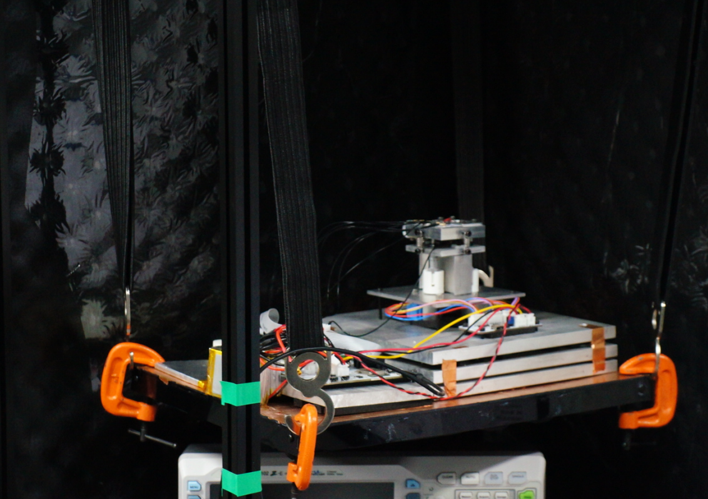

# 隔震系统搭建

        由于缺少微小震动评估设备，故本项目在结合现有的扫描隧道显微镜的减震指导理论以及搭建成本及难度后对本项目的减震系统进行简单构建。

对于高频震动的隔离，一种以金属片-氟橡胶交替的堆叠系统被提出用于扫描隧道显微镜的震动隔离[1]，再通过搭配与堆叠减震系统谐振频率不同的另一级减震系统能够实现较好效果的减震[2]。本项目使用悬挂系统进行一级减震，金属片-氟橡胶交替的堆叠系统进行二级减震。

# 参考文献

[1].    Oliva A I, Aguilar M, Sosa V. Low-and high-frequency vibration isolation for scanning probe microscopy[J]. Measurement Science and Technology, 1998, 9(3): 383.

[2].    Okano M, Kajimura K, Wakiyama S, et al. Vibration isolation for scanning tunneling microscopy[J]. Journal of Vacuum Science & Technology A: Vacuum, Surfaces, and Films, 1987, 5(6): 3313-3320.
