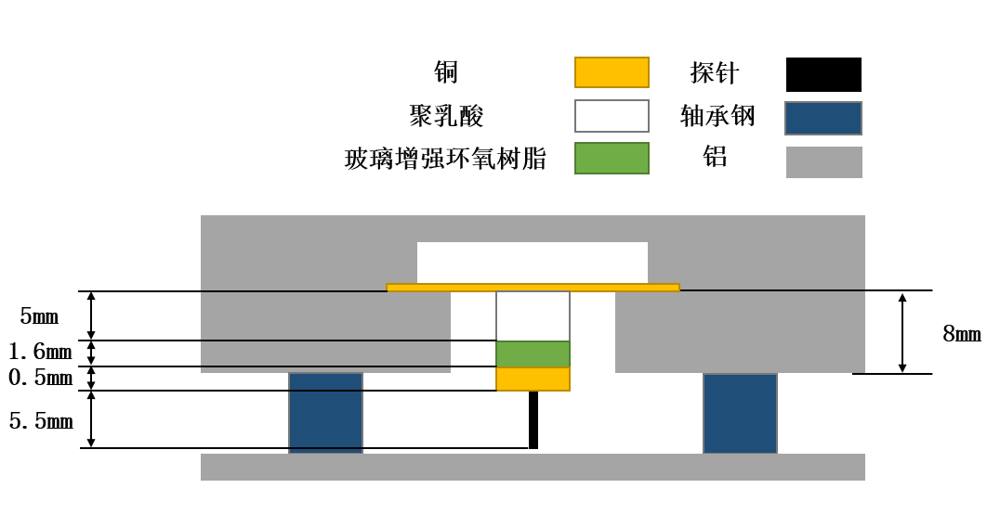

# 热失配估算

## 估算

        对于纳米尺度的隧穿距离而言，温度引起的材料膨胀将变得难以忽视。由于探针各部分材料与支撑结构材料的热膨胀系数不一致，在显微镜温度发生变化时，探针将与样品间发生相对位移。

        下面将对扫描头与支撑结构间发生的膨胀热失配进行简单的评估。

        支撑结构部分由轴承钢、铝材料组成，扫描头由聚乳酸、玻璃纤维（玻璃增强环氧树脂）、探针（铂）组成。下表列出了这些材料的线性热膨胀系数（常温）[1][2][3]。

    将支撑结构部分各材料的热膨胀系数以及扫描头部分各材料的热膨胀系数对长度加权后再进行差值运算，将可以对热失配进行简单估算：

$$
drift=L_{Al}\alpha_{Al}+L_{St} \alpha_{St}-L_{PLA} \alpha_{PLA}-L_{GRE}\alpha_{GRE}-L_{Cu} \alpha_{Cu}-L_{pt} α_{pt}
$$

取L_Al=8，L_St=4.6，α_St=10.5，L_PLA=5，L_GRE=1.6，L_Cu=0.5，L_pt=5.5，带入式计算可得热失配为-252.24 nm·℃^(-1)，即若显微镜整体结构温度上升1℃，探针将会相对支撑结构下降252.24nm。

## 现象验证

        在显微镜启动阶段时，探针通过进近算法进入隧穿距离后，在未干预探针动作的情况下隧穿电流呈现上升趋。而在显微镜启动一小时左右后，探针进入隧穿距离能够对隧穿电流进行保持，并且在增强系统散热后，在未干预探针动作的情况下隧穿电流呈下降趋势。

        分析上述现象出现的原因是由于步进电机存在发热，在显微镜启动阶段整体热量未平衡，热量上升将导致探针位置下降，隧穿距离减小，从而导致隧穿电流增加。而在显微镜启动一小时左右后，显微镜整体热量耗散平衡，显微镜整体温度基本保持不变，此时能够保持隧穿距离。在增强系统散热后，由于整体温度的下降将导致探针上升，隧穿距离增大，从而导致隧穿电流减少。

# 参考文献

[1].    Instrumentation reference book[M]. Butterworth-Heinemann, 2009.

[2].    Lanza di Scalea F. Measurement of thermal expansion coefficients of composites using strain gages[J]. Experimental mechanics, 1998, 38(4): 233-241.

[3].    Wijnen B, Sanders P, Pearce J M. Improved model and experimental validation of deformation in fused filament fabrication of polylactic acid[J]. Progress in Additive Manufacturing, 2018, 3(4): 193-203.
