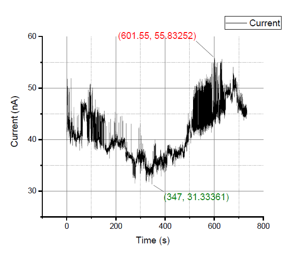
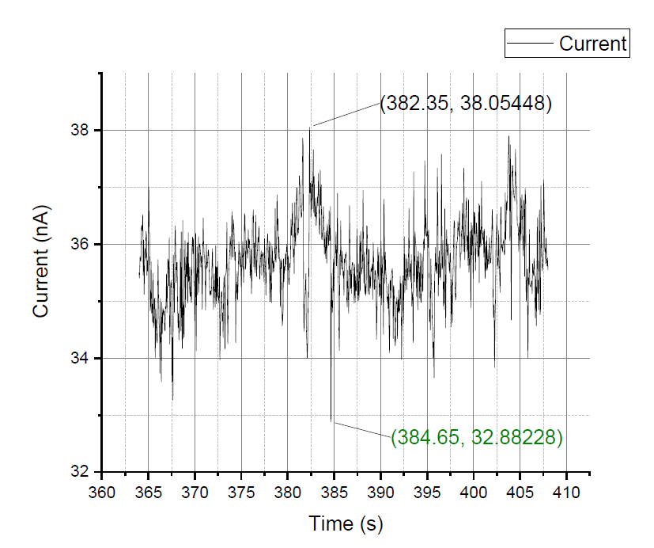
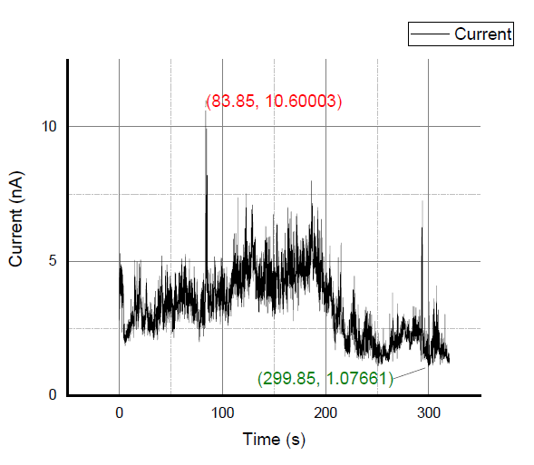

# 电流稳定性评估

## 仅耳机减震系统下的评估

        稳定的隧穿电流为显微镜的成像质量以及曲线测量提供了最基本的保障。在显微镜建立隧穿电流后，使扫描头动作停止，通过监测隧穿电流随时间变化情况可以进行电流稳定性评估,通过该评估可以简单分析震动以及热漂移对隧穿电流的影响。

        下图为样品偏置电压为50mV下，仅使用二级减震系统时，时长为733秒的测试结果。从图中可以看出，在733秒内，输出的隧穿电流值在40nA附近浮动，且整体波动幅度较大，最大值出现在601.55秒处，大小为55.8nA，最小值出现在347秒处，大小为31.3nA。对于隧穿电流整体的大幅度波动，可能是由于热膨胀导致，而对于小幅度的高频波动，可能是由于震动导致。

        以扫描一副分辨率为256×256的图像为例，单点采样时间设置为500μs时，该幅图像的采样时间为32.768s。图中出现了多个持续时长大于30s且电流较为平稳的区间，以364s至408s持续44秒的区间为例，其缩放后曲线如下图所示。在该区间内，极差为5.1722nA，对于随距离指数级变化的隧穿电流而言，该时间区间的电流变化是可以接受的。通过缩短单点采样的时间或减少采样点数量，可以进一步缩短图像扫描的时间，从而达到更稳定的图像。

## 完整减震系统下的评估

        下图为使用完整的二级减震系统下，时长为五分钟的测试结果。可以看出，相对于单第二级减震系统的测试环境，完整的二级减震系统对系统电流的稳定性有显著的提升。

        同样在该曲线中取44秒左右较平稳的时间段进行缩放，如下图所示，此时的极差被缩小至3.12nA。

## 结论

        在仅二级减震系统下，测试得到44秒区间内的电流变化曲线极差为5.1722nA。在完整减震系统下，测试得到44秒区间内的电流变化曲线极差为3.12nA。对于典型图像扫描所需时间32.768秒而言，在不同级别减震系统下的稳定性均可满足图像扫描的条件。同时测试也能够在一定程度上证明通过两级减震系统的结合，能够提升显微镜的稳定性。
