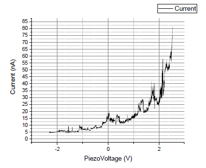
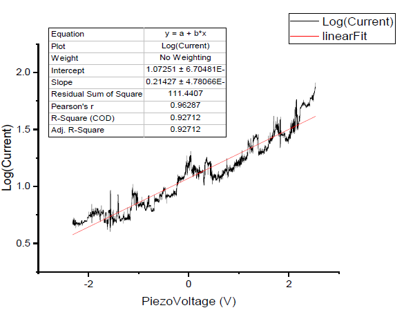

# 距离-隧穿电流测试

​		上图为对热解石墨（HOPG）样品在偏置电压为50mV下的隧穿距离-电流测试曲线。压电扫描头的Z轴步长电压为310μV，步长变化、采样时间间隔为1ms。从图中可以看出，该曲线特性满足指数特征，说明了压电扫描头的Z轴方向进给均匀，且装置所捕获的信号为隧穿电流信号。

​		上图为对热解石墨（HOPG）样品在偏置电压为50mV，步长变化、采样间隔为1ms下不同Z轴步长电压下的隧穿距离-电流测试曲线。其中，1S对应位为310μV的步长，5S对应为5×310μV=1.55mV的步长。从图中可以看出，在不同的Z轴运动速率下，曲线仍表现出指数增长的特性。