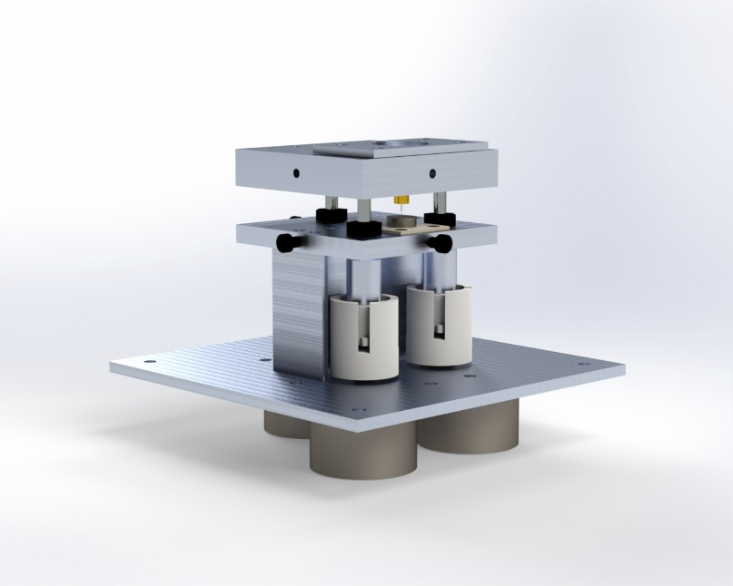
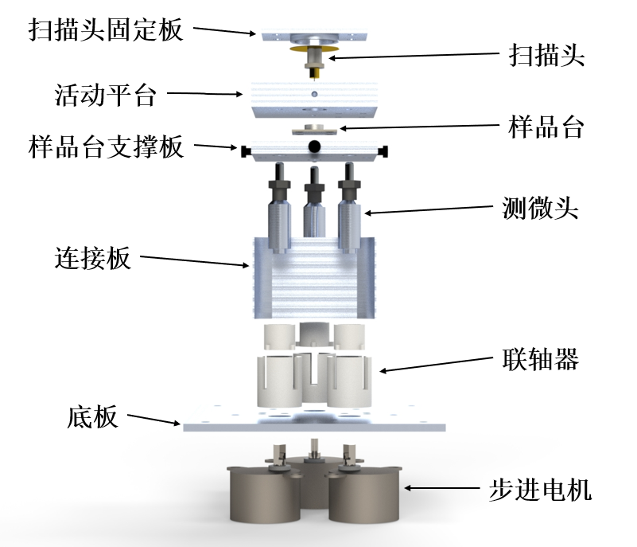
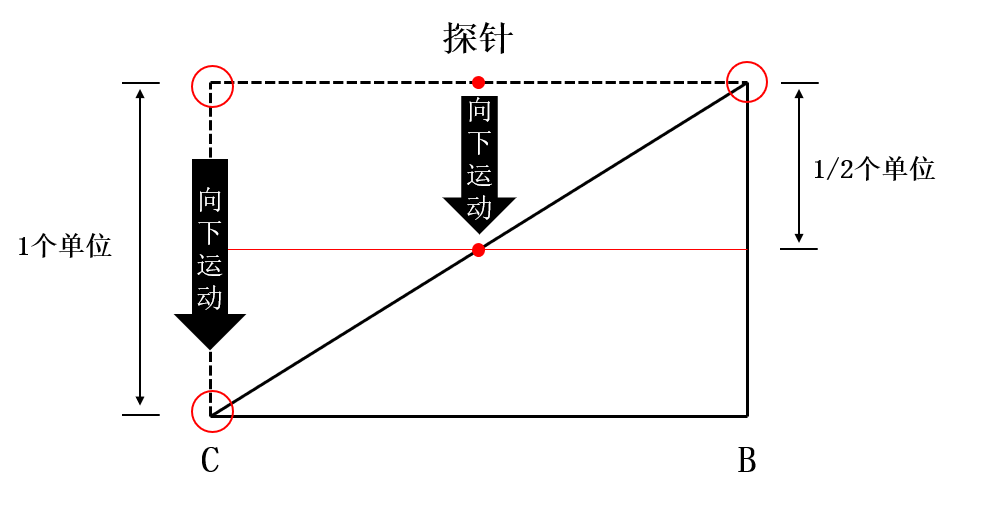

# 机械结构设计

## 设计总览

        上图分别展示了显微镜的机械结构实物图、简化渲染示意图以及机械结构爆炸视图。
机械结构的各个组成部分如图所示，各个板材使用CNC进行加工成型，联轴器使用3D打印成型。扫描头固定板将扫描头固定于活动平台上，从而实现扫描头与活动平台同步运动。活动平台被三颗能够通过旋转实现伸缩的测微头顶起，从而实现三轴式的上下运动。活动平台与样品台支撑板之间通过拉簧连接以增加牢固性。测微头通过联轴器与步进电机连接，从而实现自动旋转伸缩。

        在系统工作时，除活动平台、扫描头固定板、扫描头外所有部件均为固定状态，活动平台可以经由步进电机联动的测微头控制，带动探针上下运动实现探针对样品的相对移动。

## 机械进近结构

        K. Besocke于1986年提出了一种能够简单操作的扫描隧道显微镜结构[1]，本项目基于其三轴进近结构进行改进，搭建了机械进近结构。

        机械进近结构由活动平台及其所承载的探针与微分头组成，活动平台与三个支撑微分头构成了一个三轴姿态调整装置。微分头、活动平台、探针的俯视关系如图3.19所示，活动平台为50×50cm的正方形铝块，其上钻有三个用于定位微分头的圆形凹槽A、B、C。探针、凹槽A的圆心位于B、C凹槽圆心的垂直平分线上，探针与B、C凹槽圆心的连线向凹槽A方向偏移了0.5mm。

        当某一微分头上升或下降时，将带动活动平台在对应槽位方向发生俯仰运动。当微分头A、微分头B位置固定，微分头C向下运动一个单位时，由于探针在微分头B、C中间，通过相似三角形原理可计算出探针仅下降了1/2个单位，如图3.20所示。当微分头B、C位置固定，微分头A向下运动一个单位时，由于探针位于微分头A圆心与B、C圆心连线的1/60处，故探针仅向下运动了1/60个单位，如图所示。

        在忽略材料加工精度与探针长度的情况下，可以近似认为通过该套机械结构的最小运动缩放比为60：1。又由于本项目使用的微分头牙距为0.5mm，步进电机最小分辨率为0.044°，故在理想情况下，可近似认为该套系统的精度为

$$
0.5mm×\frac{0.044°}{360°}×\frac{1}{60}=1.019nm
$$

## 磁吸式样品台

        样品台的结构如图所示。样品台由四个部分构成：承载PCB、钕磁铁B、钕磁铁A以及样品。承载PCB通过螺丝固定在样品台支撑板上保持固定状态，圆形钕磁铁B以锡焊的方式固定在承载PCB上，圆形钕磁铁A与圆形钕磁铁B以磁吸方式连接，圆形钕磁铁A与样品通过导电银漆连接。

        在显微镜工作时，需要提前制作以圆形钕磁铁A与样品通过导电银漆粘合而成的样品磁贴，在装载样品时仅需将样品磁贴吸附在钕磁铁B上即可。由于钕磁铁表面表现为导电性质，故可以“承载PCB-圆形钕磁铁B-圆形钕磁铁A-样品”的路径对样品施加偏置电压。本项目的磁吸式样品台可以极大程度的简化装载样品的流程。

## 进近算法

        本项目采用的进近算法主要由目视进近和“啄木鸟”式进近两个部分组成，步骤框图如图所示。

        在目视进近（粗进近）开始时，微分头进行调平，使活动平台水平。调平完成后，微分头A、B、C以相同的速率下降，此时活动平台水平下降。在观察到探针较为接近样品后，微分头A停止运动，微分头B、C继续下降直至在肉眼条件下观察不出探针与样品之间缝隙，此时目视进近完成。

        在“啄木鸟”式进近（细进近）阶段，该阶段的进近操作由控制系统自动完成。首先扫描头将执行Z轴伸缩，当Z轴伸缩后无法建立隧穿电流时，系统将控制微分头A下降一定高度，随后扫描头将再次进行Z轴伸缩直至隧穿电流建立为止。

# 参考文献

[1].    Besocke K. An easily operable scanning tunneling microscope[J]. Surface Science, 1987, 181(1-2): 145-153.
