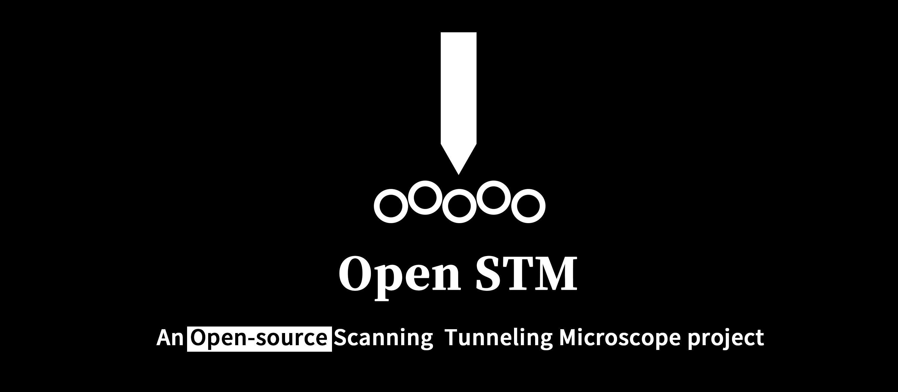
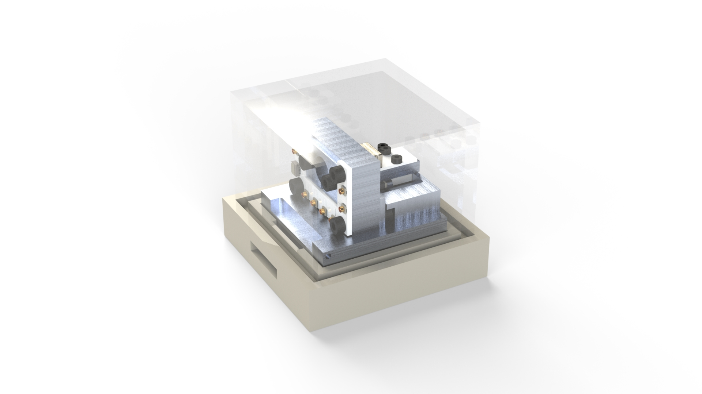
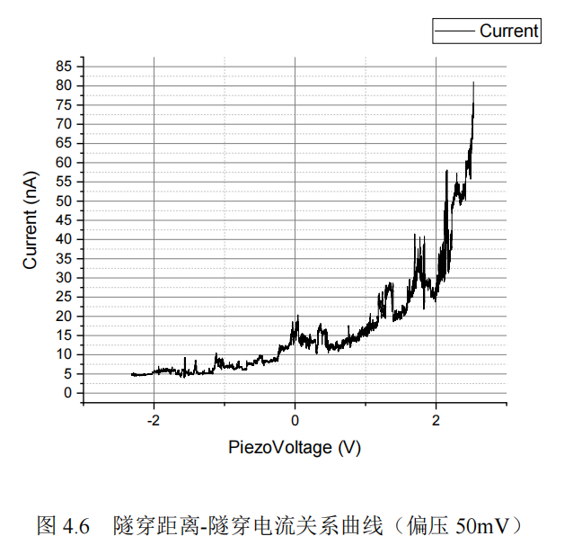
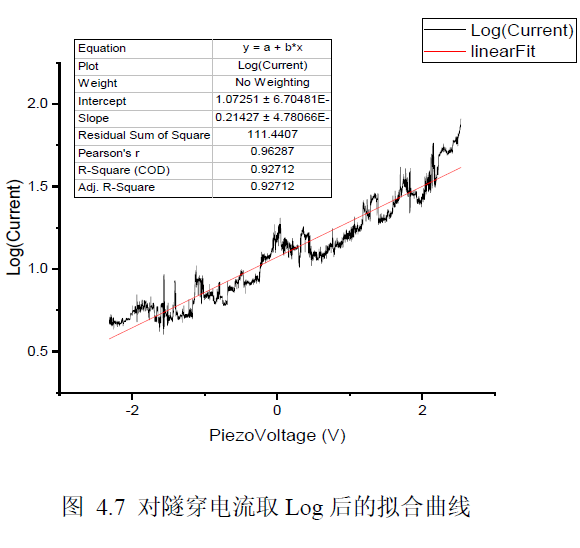
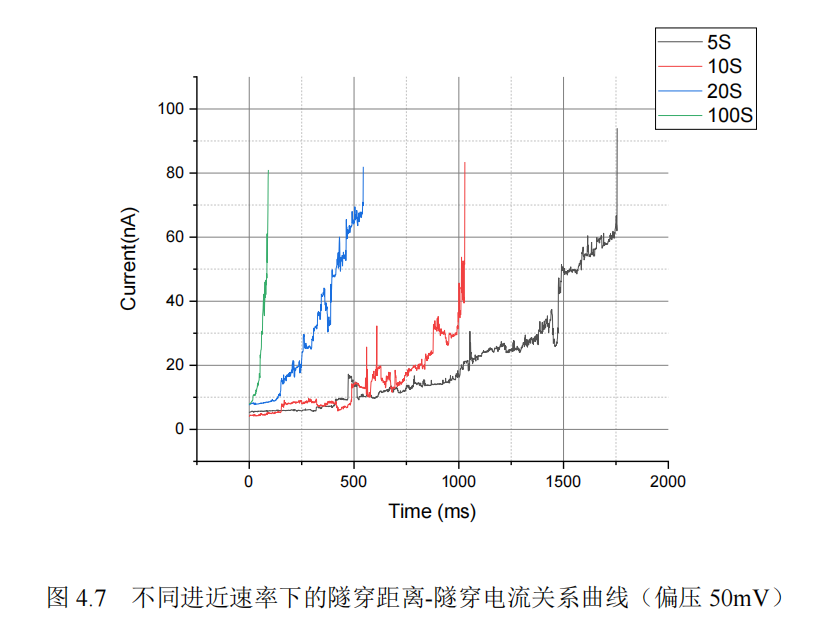
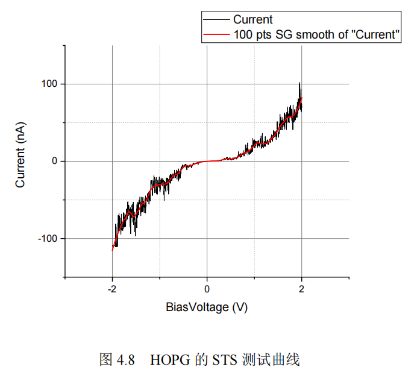
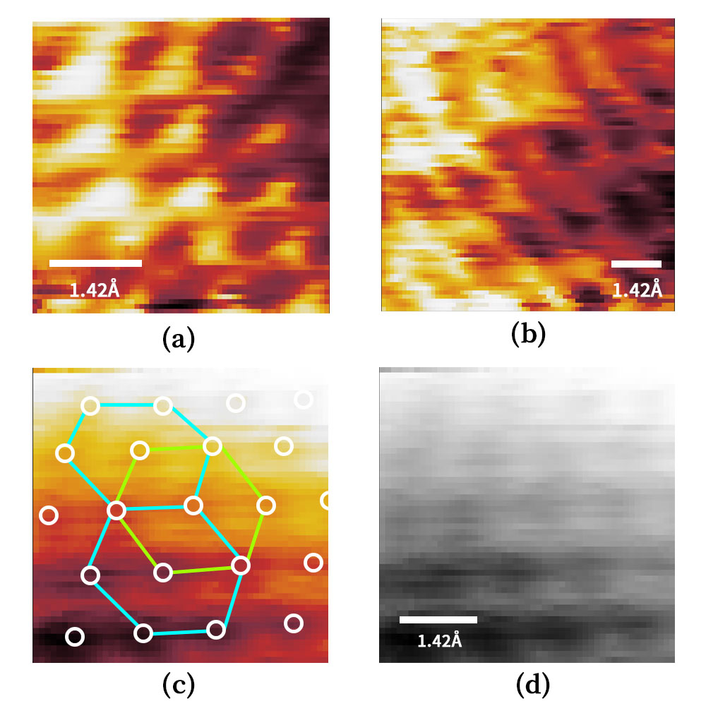

**[中文](readme.md) | [English](readme_eng.md)**

- [简介](#简介)
- [分支](#分支)
- [开源文件结构介绍](#开源文件结构介绍)
- [开发技术文档](#开发技术文档)
- [版本发布命名规则](#版本发布命名规则)
- [已发布的STM方案版本](#已发布的stm方案版本)
  - [<u>Release OpenSTM v1.0.0</u>](#urelease-openstm-v100u)
  - [<u>Release OpenSTM v2.0.0</u>](#urelease-openstm-v200u)
  - [<u>Release OpenSTM v3.0.0</u>](#urelease-openstm-v300u)
- [目前取得的成果](#目前取得的成果)
  - [隧穿距离-电流曲线](#隧穿距离-电流曲线)
  - [热解石墨（HOPG）的偏压-电流曲线](#热解石墨hopg的偏压-电流曲线)
  - [热解石墨（HOPG）原子成像](#热解石墨hopg原子成像)
- [联系我](#联系我)
- [赞助](#赞助)
- [开发记录](#开发记录)
- [致谢](#致谢)
- [参考工程](#参考工程)
- [主要参考文献](#主要参考文献)

# 简介

嗨，本项目是一个旨在通过DIY来搭建一个原子级扫描隧道显微镜。  

2022年6月，本项目已经成功测量了隧穿距离-电流曲线、热解石墨（HOPG）的偏压-电流曲线以及样品无尺寸定性成像。  

2023年5月，本项目成功扫描出热解石墨（HOPG）的碳原子。  

目前项目已经在科学开源硬件期刊《HardwareX》上发表，构建细节可参考论文内容。论文DOI：https://doi.org/10.1016/j.ohx.2023.e00504

# 分支

本仓库目前创建了两个分支，即[主分支](https://github.com/Dimsmary/OpenSTM/tree/main)(main)以及[文档分支](https://github.com/Dimsmary/OpenSTM/tree/Ref-Document)(Ref-Document)。主分支中放置了源代码等工程设计文件，文档分支放置了开发过程中参考的文档资料。之所以将这两部分分离是因为文档文件体积过于庞大所导致的。

# 开源文件结构介绍

- 3DModels

  包括**外壳设计文件**以及**CNC加工所需的STEP文件** 。

- Docs

  该目录下的文档包括了**项目概要**以及**显微镜构建指南**。
  
- Hardware
  
  包括使用ESP32 IDF编写的**单片机程序工程文件**（使用Platform IO），以及对应**固件**。
  注意！Platform IO的Platforms-Espressif 32版本应选择6.0.0，否则可能无法通过编译。

- PCB

  嘉立创EDA绘制的**PCB文件**，需要使用嘉立创EDA专业版打开。或直接在OSHW-Hub在线浏览（详见电路部分），移步[OSHWHUB](https://oshwhub.com/Dimsmary/4ieRpV8S00kGn1MTpsc4MyZat8MwQPzn)，点击右上方的“编辑器打开”。

- PythonScript  
  显微镜的上位机程序，具体使用方法参考**显微镜构建指南**。

# 开发技术文档

文档已发布在Arxiv: https://arxiv.org/abs/2310.05413, 你也可以在doc文件夹中寻找到。

# 版本发布命名规则

截至2023/10，目前已公布了三个不同机械结构的STM方案 ，其中V3.0.0版本已经可以实现STM的基本功能。

本项目将参考软件发行的方式，在STM方案更新后，采用Release的方式对方案进行发布，每次发布的STM方案版本号命名规则如下：

版本号以**A.B.C**式命名，当方案机械结构存在重构时，A将发生变化。在方案的电路、软件、机械结构存在较大的修改时，B将发生变化。当方案存在细微修改时，C将发生变化。

以1.0.0为例，该版本号即代表第一代机械结构的STM设计方案。

# 已发布的STM方案版本

## [<u>Release OpenSTM v1.0.0</u>](https://github.com/Dimsmary/OpenSTM/releases/tag/v1.0.0)

这是初代STM方案，机械结构采用两块铝板搭建：[<u>你，亲眼看过原子吗？ - 哔哩哔哩</u>](https://www.bilibili.com/video/BV1Jr4y1v7gq)  

方案较为简单，没有取得能够用于分析的实验结果，但后续方案的搭建基于本初代方案进行搭建，本版本的方案仅供参考，暂不提供详细的文档资料。  
发布的方案文件包括了：

- 3D模型文件（SolidWorks）
- Arduino程序：用于控制STM的ESP32单片机控制程序（采用LVGL进行交互）、基于MPU9250的震动探测程序，均采用Arduino+Platform IO进行开发
- PCB及原理图
- 用于测量干涉条纹的Python脚本
- LTSpice对电源芯片的仿真文件

## [<u>Release OpenSTM v2.0.0</u>](https://github.com/Dimsmary/OpenSTM/releases/tag/v2.0.0)

该版本方案为第二代显微镜结构：  [<u>耗时九个月，我可能来到了纳米尺度...... - 哔哩哔哩</u>](https://www.bilibili.com/video/BV1eB4y1S7u8)

该方案的结构能够测量：

- 隧穿距离-电流曲线
- 扫描隧道谱（STS）

v2.0.0.zip内含的文件包括：

- 3DModel：SolidWorks绘制的3D模型文件、CNC加工所需的STEP文件
- PCB：立创EDA专业版绘制的原理图、PCB文件
- Software：在Arduino文件夹下，包含ESP32单片机的控制程序、ATMEGA 328P单片机的控制程序。在Python文件夹下，包含了上位机控制软件、图像转换程序

## [<u>Release OpenSTM v3.0.0</u>](https://github.com/Dimsmary/OpenSTM/releases/tag/v3.0.0)

第三代扫描隧道显微镜，功能基本完善的一个版本，能够完成基本的曲线测量以及HOPG原子成像。
视频：https://www.bilibili.com/video/BV1TN411r7jG
复刻论文手稿：https://arxiv.org/abs/2310.05413
详细内容请参考手稿。

# 目前取得的成果

## 隧穿距离-电流曲线

  

  

## 热解石墨（HOPG）的偏压-电流曲线

## 热解石墨（HOPG）原子成像

# 联系我

  如果你也想制作一个STM显微镜，或者对我有什么建议的话，可以在此页面提交Issue。

# 赞助

如果你喜欢本项目，欢迎在爱发电对我进行赞助：https://afdian.net/a/dimsmary

赞助可获得概述中文版一份。（虽然复刻指南已经发布在了Arxiv，但这里还是有一份中文省流版；
这份文档是对项目的一个概述，相较于readme更为详细，但复刻还是要参考Arxiv论文）

# 开发记录

- 2021/11
  
  不稳定隧穿

- 2022/1/11
  
  开源页面提交

- 2022/1/18
  
  减震台下加装了<网球>，减震效果拔群

- 2022/2/05
  
  1）系统模拟部分供电改为9V电池供电，数字部分继续使用开关电源。  
  2）ADP5070不工作了，奶奶的！为什么。  
  3）在《 Construction of a scanning tunneling microscope for imaging of carbon nanotubes》P35中发现隧穿电流应在100pA - 10nA，按照现有运放的倍数应该关注1V以内的信号，之前看样子搞错了。  
  4）OPA627的 ~~开环电压增益有120dB，~~ 输入偏置电流1pA，讲道理用100MΩ的反馈电阻应该是可行的？  

- 2022/2/16  
  
  对运放的输入输出特性进行了测试，证明前级隧道电流放大电路是可行的。

- 2022/3/14  
  
  1）CNC加工的新结构加工完成  
  2）摒弃LVGL与显示屏作为控制系统  

- 2022/3/21  
  
  使用了新的结构系统、电路、控制系统进行了隧穿电流进近测试：  
  1）隧穿电流初步稳定，能够维持十几秒。  
  2）通过八个点的采样测试隧穿电流-压电陶瓷形变曲线发现基本符合指数特征。  
  3）确认并不需要非常复杂的减震系统。  
  4）基本确认之前出现的输出跳动现象为热膨胀的失配。

- 2022/4/12  
  
  1）在对进近机械结构中的步进电机进行热隔离调整后，隧穿电流已非常稳定，能够维持至少30分钟。  
  2）对新的隧穿曲线进行分析，发现电流-压电陶瓷形变关系并不只是单纯的指数关系，结合老师给出的意见，怀疑有其他函数复合。初步怀疑为针尖与样品间形成的电容器导致的。  
  3）完善了细进近控制算法，现在可以点击开始进近之后去打几把极地大乱斗。  
  4）模拟部分供电由9V电池供电更换为3S锂聚合物电池供电。

- 2022/4/20  
  完成恒高模式下的STM图像扫描，并经过重复性实验验证，但无法确定图像尺度以及成像内容的完全可靠。

- 2022/5/01  
  攥写毕业设计论文。

- 2022/5/04  
  毕业设计论文攥写完成70%，开始编写恒流扫描算法。  

- 2022/6/16  
  第二代显微镜开源资料公布  

- 2022/10/21
  
  开始设计粘滑压电马达

- 2022/10/26
  
  完善技术文档
  
- 2023/1/4
  第三代电路、机械结构重构完成，粘滑压电马达设计完成，进入调试阶段（目前未发布，待验证后发布）。
  
  （1）电路电源方面：重构后的电路采用ADP5070搭配低噪声LDO的方案提供多个电源轨道（双±12V、5V），ADP5070采用紫米35W双C口电源适配器进行5V供电（原因在于该电源纹波极低，峰峰值在13mV左右，呈现为锯齿状）。
  
  （2）PCB板层设计方面：新一代电路板分为三块：电源板、MCU板、控制板。电源线在板之间采用同轴信号线连接，数据线采用IDC排线连接。
  
  （3）电路改进方面：MCU板继续沿用ESP32作为控制器，但模组型号更新为ESP32-S3，并留有WIFI天线挖槽，为日后升级做准备。控制板沿用第二代大部分设计保持不变，继续使用AD5761+OPA2227的方案对扫描头进行控制，但由于压电滑台的引入，控制板额外添加了AD8761作为对样品施加偏压的DAC，原本用于施加偏压的DAC现用于控制压电滑台。
  
  （4）机械结构设计方面：新一代机械结构整体尺寸缩小，并引入了粘-滑压电滑台进行粗进近（参考文章《Open-source XYZ nanopositioner for high-precision analytical applications》），并对前级放大器进行了金属全包裹屏蔽，进一步降低噪声耦合。
  
- 2023/1/18

  MCU模组更换为ESP32-WROOM-32E，S3模组的编译出现了一些问题，资料较少暂时无法解决。
  
  另外，为了提升MCU的效率，将开发框架从Arduino变更为ESP-IDF（从简单的GPIO翻转代码中发现，Platform IO + Arduino速度为800Khz，Arduino IDE为1.2Mhz，Platform IO + ESP-IDF为1.44Mhz）。
  
- 2023/2/12
  
  第三代电路、机械结构修改、验证完成。
  
  目前正在重构上位机、控制程序，截止目前已实现探针进近的PID控制，电流相较于上一代设计更加稳定，温漂问题得到很大程度改善。
  
- 2023/03/31
  
  1）发现了一些在压电滑台组装时遇到的问题：虽然压电滑台组装难度不高，但滑台在安装时需要与施加压力的磁铁保持一定程度的平行，否则压电滑台将无法长距离工作。
  
  2）拟设计两种压电滑台结构以适配不同形状的压电陶瓷
  
  3）软件完成D-I曲线测试以及偏压测试功能
  
- 2023/05/02
  
  1）完成了对HOPG的扫描，可以观察到碳原子模糊的轮廓。
  
  2）发现了一个有趣的现象：在探测HOPG样品的过程中，探针接近完成后的隧穿电流将会产生波动（环境振动引起），若此时的探针锐度达到了原子级分辨率，隧穿电流的波动曲线将会被耦合进一个类正弦波的曲线，并且在撞针后，这个耦合将消失（确定不为市电干扰，其波动周期为1.4ms左右，且在撞针后会消失）。
  
  我认为这是因为探针在进入隧穿距离之后，在环境振动的带动下，探针的X/Y轴将随着振动而移动，形成“扫描”的效果，碳原子表面的起伏将导致电流的周期性变化。
  
- 2023/05/03
  
  观察到HOPG上碳原子清晰的轮廓

- 2023/10/10

  三代机HardwareX手稿发布在Arxiv上：https://arxiv.org/abs/2310.05413

# 致谢

**五邑大学以及五邑大学的老师们**

**深圳嘉立创科技集团股份有限公司**

**Jürgen Müller**

**Daniel Berard的STM开源工程**

**John D. Alexander的STM开源工程**

**中国科学院光电技术研究所**

**所有为本项目提供建议的哔哩哔哩朋友**

# 参考工程

[1] John Alexander: STM Project, http://web.archive.org/web/20121107205242/http://www.geocities.com/spm_stm/Project.html

[2] Dan Berard: Home-Built STM, https://dberard.com/home-built-stm/

[3] Jürgen Müller: Homebrew STM, http://www.e-basteln.de/other/stm/overview/

[4] NanoSurf: NaioSTM, https://www.nanosurf.com/en/products/naiostm-stm-for-nanoeducation

# 主要参考文献 

[1].  Binnig G, Rohrer H. Scanning tunneling microscope: U.S. Patent 4,343,993[P]. 1982-8-10.

[2].  Besocke K. An easily operable scanning tunneling microscope[J]. Surface Science, 1987, 181(1-2): 145-153.

[3].  Ellis M D. Construction of a scanning tunneling microscope for imaging of carbon nanotubes[D]. Texas Tech University, 1998.

[4].  Rogers B L, Shapter J G, Skinner W M, et al. A method for production of cheap, reliable pt–ir tips[J]. Review of Scientific Instruments, 2000, 71(4): 1702-1705.

[5].  王琦. 高稳定扫描隧道显微镜的研制与应用[D].  中国科学技术大学,2014.

[6].  Petersen J P, Kandel S A. Circuit design considerations for current preamplifiers for scanning tunneling microscopy[J]. 2017.

[7].  Lounis S. Theory of scanning tunneling microscopy[J]. arXiv preprint arXiv:1404.0961, 2014.

[8].  Purdue University. TEM Pictures of STM Tips[EB/OL]. 2002[2022-9-20]. https://www.physics.purdue.edu/nanophys/uhvstm/tip.html.

[9].  Bai C. Scanning tunneling microscopy and its application[M]. Springer Science & Business Media, 2000.

[10].  Nasrollahzadeh M, Sajadi M S, Atarod M, et al. An introduction to green nanotechnology[M]. Academic Press, 2019:199-322.

[11].  Baird D, Shew A. Probing the history of scanning tunneling microscopy[J]. Discovering the nanoscale, 2004, 2: 145-156.

[12].  Merzbacher E. Quantum mechanics[M]. Jones & Bartlett Publishers, 1961.

[13].  曾谨言. 量子力学导论[M]. 第二版. 北京大学出版社, 2001.

[14].  Grafstrom S, Kowalski J, Neumann R. Design and detailed analysis of a scanning tunnelling microscope[J]. Measurement Science and Technology, 1990, 1(2): 139.

[15].  Nam A J, Teren A, Lusby T A, et al. Benign making of sharp tips for STM and FIM: Pt, Ir, Au, Pd, and Rh[J]. Journal of Vacuum Science & Technology B: Microelectronics and Nanometer Structures Processing, Measurement, and Phenomena, 1995, 13(4): 1556-1559.

[16].  Hahn J R, Hong Y A, Kang H. Electron tunneling across an interfacial water layer inside an STM junction: tunneling distance, barrier height and water polarization effect[J]. Applied Physics A, 1998, 66(1): S467-S472.

[17]. Woo D H, Choi E M, Yoon Y H, et al. Current–distance–voltage characteristics of electron tunneling through an electrochemical STM junction[J]. Surface science, 2007, 601(6): 1554-1559.

[18]. Alexander J D, Tortonese M, Nguyen T. Atomic force microscope with integrated optics for attachment to optical microscope: U.S. Patent 5,952,657[P]. 1999-9-14.

[19]. 陈大任,李国荣,殷庆瑞.逆压电效应的压电常数和压电陶瓷微位移驱动器[J].无机材料学报,1997(06):861-866.

[20]. Fialka J, Benes P, Michlovska L, et al. Measurement of thermal depolarization effects in piezoelectric coefficients of soft PZT ceramics via the frequency and direct methods[J]. Journal of the European Ceramic Society, 2016, 36(11): 2727-2738.

[21]. Instrumentation reference book[M]. Butterworth-Heinemann, 2009.

[22]. Lanza di Scalea F. Measurement of thermal expansion coefficients of composites using strain gages[J]. Experimental mechanics, 1998, 38(4): 233-241.

[23]. Wijnen B, Sanders P, Pearce J M. Improved model and experimental validation of deformation in fused filament fabrication of polylactic acid[J]. Progress in Additive Manufacturing, 2018, 3(4): 193-203.

[24]. Oliva A I, Aguilar M, Sosa V. Low-and high-frequency vibration isolation for scanning probe microscopy[J]. Measurement Science and Technology, 1998, 9(3): 383.

[25]. Okano M, Kajimura K, Wakiyama S, et al. Vibration isolation for scanning tunneling microscopy[J]. Journal of Vacuum Science & Technology A: Vacuum, Surfaces, and Films, 1987, 5(6): 3313-3320.

[26]. Walzer K, Sternberg M, Hietschold M. Formation and characterization of coronene monolayers on HOPG (0001) and MoS2 (0001): a combined STM/STS and tight-binding study[J]. Surface science, 1998, 415(3): 376-384.

[27]. Kusunoki K, Sakata I, Miyamura K. Interaction between Tip and HOPG Surface Studied by STS[C]//Analytical Sciences/Supplements Proceedings of IUPAC International Congress on Analytical Sciences 2001 (ICAS 2001). The Japan Society for Analytical Chemistry, 2002: i1267-i1268.

[28]. Chen C J. Theory of scanning tunneling spectroscopy[J]. Journal of Vacuum Science & Technology A: Vacuum, Surfaces, and Films, 1988, 6(2): 319-322.

[29]. El Abedin S Z, Borissenko N, Endres F. Electrodeposition of nanoscale silicon in a room temperature ionic liquid[J]. Electrochemistry communications, 2004, 6(5): 510-514.

[30]. Walzer K, Hietschold M. STM and STS investigation of ultrathin tin phthalocyanine layers adsorbed on HOPG (0001) and Au (111)[J]. Surface science, 2001, 471(1-3): 1-10.

[31].  Liao H S, Werner C, Slipets R, et al. Low-cost, open-source XYZ nanopositioner for high-precision analytical applications[J]. HardwareX, 2022: e00317.

[32]. De Voogd J M, Van Spronsen M A, Kalff F E, et al. Fast and reliable pre-approach for scanning probe microscopes based on tip-sample capacitance[J]. Ultramicroscopy, 2017, 181: 61-69.

[33]. Wallash A J, Levit L. Electrical breakdown and ESD phenomena for devices with nanometer-to-micron gaps[C]//Reliability, Testing, and Characterization of MEMS/MOEMS Ii. SPIE, 2003, 4980: 87-96.

[34]. Gao C, Kuhlmann-Wilsdorf D, Makel D D. The dynamic analysis of stick-slip motion[J]. Wear, 1994, 173(1-2): 1-12.

