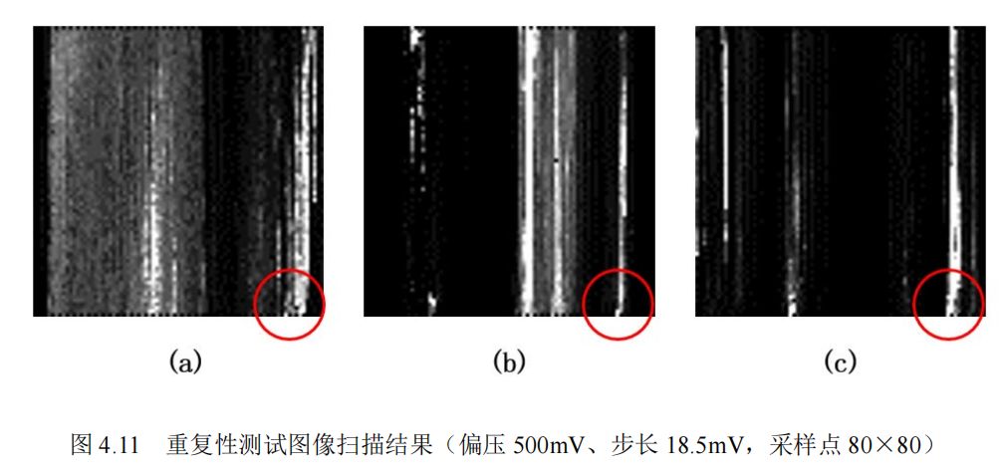
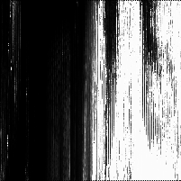
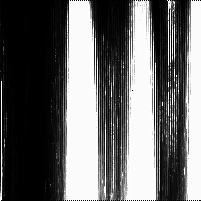
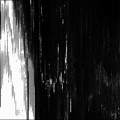

# 简介

你好，本项目是一个旨在通过DIY来搭建一个原子级扫描隧道显微镜。  

截止至2022年6月，本项目已经成功测量了隧穿距离-电流曲线、热解石墨（HOPG）的扫描隧道光谱曲线（STS）以及样品无尺寸定性成像。  

# 开源文件结构介绍

*由于时间关系，详细的说明文档将在后续完善。  

- Archive  
  该目录下为第一代显微镜的开源资料，详见其内readme  
- 3DModel  
  该目录内包括了外壳设计文件、CNC加工所需的STEP文件  
- Software  
  该目录下包括了单片机程序（使用[Arduino](https://www.arduino.cc/)、[PlatformIO](https://platformio.org/)完成），用于控制单片机的Python程序（通过串口与单片机通讯，界面设计基于QT），用于转换扫描图像的Python程序。
- Document
  该目录下包括了在开发过程中参考的论文、数据手册。（如涉及版权问题，请提交Issue删除）

## 电路部分

- 电路使用嘉立创EDA进行绘制，请移步[OSHWHUB](https://oshwhub.com/Dimsmary/4ieRpV8S00kGn1MTpsc4MyZat8MwQPzn)，点击右上方的“编辑器打开”。

# 成果

## 隧穿距离-电流曲线

  
  

## 热解石墨（HOPG）的扫描隧道光谱曲线

## 热解石墨（HOPG）样品的无尺寸定性成像

  
  
  
  

# 联系我

  如果你也想制作一个STM显微镜，或者对我有什么建议的话，可以在此页面提交Issue。

# 开发记录

- 2021/11
  
  不稳定隧穿

- 2022/1/11
  
  开源页面提交

- 2022/1/18
  
  减震台下加装了<网球>，减震效果拔群

- 2022/2/05
  
  1）系统模拟部分供电改为9V电池供电，数字部分继续使用开关电源。  
  2）ADP5070不工作了，奶奶的！为什么。  
  3）在《 Construction of a scanning tunneling microscope for imaging of carbon nanotubes》P35中发现隧穿电流应在100pA - 10nA，按照现有运放的倍数应该关注1V以内的信号，之前看样子搞错了。  
  4）OPA627的 ~~开环电压增益有120dB，~~ 输入偏置电流1pA，讲道理用100MΩ的反馈电阻应该是可行的？  

- 2022/2/16  
  
  对运放的输入输出特性进行了测试，证明前级隧道电流放大电路是可行的。

- 2022/3/14  
  
  1）CNC加工的新结构加工完成  
  2）摒弃LVGL与显示屏作为控制系统  

- 2022/3/21  
  
  使用了新的结构系统、电路、控制系统进行了隧穿电流进近测试：  
  1）隧穿电流初步稳定，能够维持十几秒。  
  2）通过八个点的采样测试隧穿电流-压电陶瓷形变曲线发现基本符合指数特征。  
  3）确认并不需要非常复杂的减震系统。  
  4）基本确认之前出现的输出跳动现象为热膨胀的失配。

- 2022/4/12  
  
  1）在对进近机械结构中的步进电机进行热隔离调整后，隧穿电流已非常稳定，能够维持至少30分钟。  
  2）对新的隧穿曲线进行分析，发现电流-压电陶瓷形变关系并不只是单纯的指数关系，结合老师给出的意见，怀疑有其他函数复合。初步怀疑为针尖与样品间形成的电容器导致的。  
  3）完善了细进近控制算法，现在可以点击开始进近之后去打几把极地大乱斗。  
  4）模拟部分供电由9V电池供电更换为3S锂聚合物电池供电。

- 2022/4/20  
  完成恒高模式下的STM图像扫描，并经过重复性实验验证，但无法确定图像尺度以及成像内容的完全可靠。

- 2022/5/01  
  攥写毕业设计论文。

- 2022/5/04  
  毕业设计论文攥写完成70%，开始编写恒流扫描算法。  

- 2022/6/16  
  第二代显微镜开源资料公布  