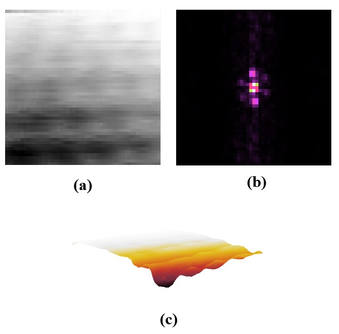

**[中文](readme.md) | [English](readme_eng.md)**

# Introduction

Hi, this is a DIY STM(Scanning Tunneling Microscope) project!

In June 2022: the distance-tunneling current curve, and bias voltage-tunneling current curve of HOPG were measured.

In May 2023, the image of HOPG in atom resolution was obtained.

**The replication manual manuscript has been published on Arxiv: https://arxiv.org/abs/2310.05413. The replication steps and required details can all be found in the manuscript.**

# Branches

Currently, the repository has two branches: [main ](https://github.com/Dimsmary/OpenSTM/tree/main)and [Ref-Document](https://github.com/Dimsmary/OpenSTM/tree/Ref-Document).

The open-source file was included in the main, and the references(datasheet, paper, etc.) documents were in the Ref-Documents branches. Since the documents file occupies a large amount of space, I have to separate the documents file into another branch.

# File Structure

- 3DModels

  Included **design file of structure** and **STEP file for CNC**

- Docs

  Included **project introduction** and **build tutorial**
  
- Hardware
  
  **MCU source code**(by ESP-IDF and Platform IO) and **firmware**

- PCB

  PCB file(Easy EDA), browsing online: [OSHWHUB](https://oshwhub.com/Dimsmary/4ieRpV8S00kGn1MTpsc4MyZat8MwQPzn)

- PythonScript  
  
  Control software code

# Document

The document has been published on Arxiv: https://arxiv.org/abs/2310.05413, and you can also find it in the doc folder.

# Version Release Naming Rules

As of October 2023, three different mechanical structures for the STM (Scanning Tunneling Microscope) have been published, with version 3.0.0 capable of basic STM functionality.

This project will follow the software release approach, where after each update in the STM design, a release will be made. The version numbering for each released STM design will follow the following format:

The version number will be in the format of **A.B.C**. When there is a significant reconstruction of the mechanical structure, A will change. When there are substantial changes to the circuitry, software, or mechanical structure of the design, B will change. When there are minor modifications to the design, C will change.

For example, 1.0.0 represents the first-generation mechanical structure design of the STM.

# Releases

## [<u>Release OpenSTM v1.0.0</u>](https://github.com/Dimsmary/OpenSTM/releases/tag/v1.0.0)

This is the first-generation STM (Scanning Tunneling Microscope) design, constructed using two aluminum plates. You can view it here: https://www.youtube.com/watch?v=NZt7yUdhfqY

This design is relatively simple and did not yield experimental results suitable for analysis. However, subsequent designs are built upon this first-generation design. This version of the design is provided for reference only and does not currently include detailed documentation.

The released design files include:

- 3D model files (SolidWorks).
- Arduino programs: These programs control the STM and include the ESP32 microcontroller control program (using LVGL for interaction) and a vibration detection program based on the MPU9250. Both were developed using Arduino and Platform IO.
- PCB and schematic files.
- Python scripts for measuring interference fringes.
- LTSpice simulation files for the power supply chip.

## [<u>Release OpenSTM v2.0.0</u>](https://github.com/Dimsmary/OpenSTM/releases/tag/v2.0.0)

This version of the design represents the second-generation microscope structure. You can view it here: https://www.youtube.com/watch?v=2gPIJrTNqIA

The structure of this design allows for the measurement of:

- Tunneling distance-current curves.
- Scanning Tunneling Spectroscopy (STS).

The files included in v2.0.0.zip are:

- 3DModel: 3D model files drawn in SolidWorks and STEP files required for CNC machining.
- PCB: Schematics and PCB files drawn using the professional version of Jialichuang EDA.
- Software: In the Arduino folder, it includes control programs for the ESP32 microcontroller and the ATMEGA 328P microcontroller. In the Python folder, it contains the upper-level control software and image conversion programs.

## [Release OpenSTM v3.0.0](https://github.com/Dimsmary/OpenSTM/releases/tag/v3.0.0)

This is the third-generation scanning tunneling microscope, a version with basic functionality that can perform curve measurements and HOPG atomic imaging. Video: https://www.youtube.com/watch?v=noWLMcfyqbQ Replication paper manuscript: https://arxiv.org/abs/2310.05413 For detailed information, please refer to the manuscript.

# Results

## Distance-tunneling current curve

  

  

## Bias voltage-tunneling current curve of HOPG

## Atom image of HOPG

# Contact me

If you would like to build an STM microscope yourself or have any suggestions for me, you can submit an issue on this page.

# Development Record

- November 2021

  Unstable tunneling.

- January 11, 2022

  Submission of the open-source page.

- January 18, 2022

  Added tennis balls under the vibration isolation table, significantly improving vibration isolation.

- February 05, 2022

  1. Changed the power supply for the system simulation part to 9V battery while continuing to use a switch power supply for the digital part.
  2. ADP5070 stopped working. Frustrating!
  3. Discovered that tunneling current should be between 100pA - 10nA, which suggests signals within 1V for the existing op-amps, realizing previous mistakes.s
  4. OPA627 has an open-loop voltage gain of 120dB and input bias current of 1pA, making it reasonable to use a 100MΩ feedback resistor?

- February 16, 2022

  Tested the input-output characteristics of the op-amp, confirming the feasibility of the front-end tunnel current amplification circuit.

- March 14, 2022

  1. Completed CNC machining for the new structural design.
  2. Abandoned LVGL and display as the control system.

- March 21, 2022

  Conducted tunnel current approach tests using the new structural system, circuit, and control system:

  1. Tunnel current is initially stable and can be maintained for about ten seconds.
  2. Found that the tunnel current-piezoelectric ceramic deformation curve, sampled at eight points, generally follows exponential characteristics.
  3. Confirmed that a complex vibration isolation system is not required.
  4. Essentially confirmed that the previous output jumping phenomenon was due to thermal expansion mismatch.

- April 12, 2022

  1. Tunnel current has become very stable after adjusting the heat isolation of the stepping motor in the approach mechanical structure. It can now be maintained for at least 30 minutes.
  2. Analyzed the new tunneling curve and suspected that the current-piezoelectric ceramic deformation relationship is not purely exponential. It might be due to the formation of a capacitor between the tip and the sample.
  3. Improved the fine approach control algorithm, allowing you to engage in polar battles after clicking "start approach."
  4. Changed the power supply for the simulation part from a 9V battery to a 3S lithium-polymer battery.

- April 20, 2022

  Completed STM image scanning in constant height mode and verified it through repeated experiments, but could not reliably determine the image scale and content.

- May 01, 2022

  Started writing the graduation thesis.

- May 04, 2022

  70% of the graduation thesis writing is complete, began writing the constant current scanning algorithm.

- June 16, 2022

  Released open-source materials for the second-generation microscope.

- October 21, 2022

  Started designing stick-slip piezoelectric motors.

- October 26, 2022

  Improved technical documentation.

- January 4, 2023

  Completed the reconstruction of the third-generation circuit and mechanical structure, designed the stick-slip piezoelectric motor, and entered the debugging phase (not yet released, pending validation).

  (1) Regarding circuit power supply: The reconstructed circuit uses the ADP5070 with a low-noise LDO scheme to provide multiple power rails (dual ±12V, 5V). The ADP5070 is powered by a 35W dual-C port power adapter with extremely low ripple (peaking at around 13mV, resembling a sawtooth wave).

  (2) Regarding PCB layer design: The new generation circuit board is divided into three parts: power board, MCU board, and control board. Coaxial signal lines are used for connections between the boards, while IDC ribbon cables are used for data lines.

  (3) Regarding circuit improvements: The MCU board continues to use ESP32 as the controller, but the module model is updated to ESP32-S3, with a slot reserved for a WIFI antenna for future upgrades. The control board largely maintains the design of the second generation, continuing to use the AD5761+OPA2227 scheme to control the scanning head. However, due to the introduction of the piezoelectric slide stage, the control board adds an AD8761 as a DAC to apply bias voltage to the sample, repurposing the originally used DAC for biasing to control the piezoelectric slide stage.

  (4) Regarding mechanical structure design: The new generation mechanical structure has reduced overall dimensions and introduced a stick-slip piezoelectric slide stage for coarse approach (referencing the article "Open-source XYZ nanopositioner for high-precision analytical applications"). Additionally, the front-end amplifier has been further shielded with full metal wrapping to further reduce noise coupling.

- January 18, 2023

  The MCU module was changed to ESP32-WROOM-32E, and some issues arose with the S3 module that currently cannot be resolved due to limited documentation. To improve MCU efficiency, the development framework was changed from Arduino to ESP-IDF (simple GPIO code flipping revealed that Platform IO + Arduino runs at 800KHz, Arduino IDE at 1.2MHz, and Platform IO + ESP-IDF at 1.44MHz).

- February 12, 2023

  Completed modifications and validation of the third-generation circuit, mechanical structure, and testing are ongoing. Currently, PID control for probe approach has been implemented, resulting in more stable current compared to the previous generation, and a significant improvement in thermal drift issues.

- March 31, 2023

  1. Encountered some issues during the assembly of the piezoelectric slide stage: Although the assembly difficulty of the piezoelectric slide stage is not high, the slide stage needs to be kept somewhat parallel to the magnet applying pressure during installation; otherwise, the piezoelectric slide stage will not work over long distances.
  2. Planning to design two piezoelectric slide stage structures to adapt to different shapes of piezoelectric ceramics.
  3. Software completed D-I curve testing and bias testing functionality.

- May 02, 2023

  1. Completed scanning of HOPG, and observed the blurred outline of carbon atoms.
  2. Discovered an interesting phenomenon: during the detection of HOPG samples, the tunneling current will fluctuate as the probe approaches (caused by environmental vibrations). If the sharpness of the probe reaches atomic resolution at this time, the fluctuation curve of the tunneling current will be coupled into a sinusoidal-like curve, and this coupling will disappear after a collision with the sample (confirmed not to be interference from the power grid, with a fluctuation period of about 1.4ms and disappearing after a probe collision).

  I believe this is because after entering the tunneling distance, the probe's X/Y axis moves with the vibration caused by environmental vibrations, creating a "scanning" effect, and the undulations on the carbon atom surface lead to periodic variations in current.

- May 03, 2023

  Observed clear outlines of carbon atoms on HOPG.

- October 10, 2023

  The HardwareX manuscript for the third-generation hardware has been published on Arxiv: https://arxiv.org/abs/2310.05413.
# Acknowledgement

**Wuyi University and Teachers**

**JLC PCB and Easy EDA Team**

**Jürgen Müller**

**Daniel Berard's Project'**

**John D. Alexander's Project**

**Institude of Optics and Electronics, Chinese Academy of Sciences**

**All friends from Bilibili**

# Reference Project

[1] John Alexander: STM Project, http://web.archive.org/web/20121107205242/http://www.geocities.com/spm_stm/Project.html

[2] Dan Berard: Home-Built STM, https://dberard.com/home-built-stm/

[3] Jürgen Müller: Homebrew STM, http://www.e-basteln.de/other/stm/overview/

[4] NanoSurf: NaioSTM, https://www.nanosurf.com/en/products/naiostm-stm-for-nanoeducation

# Reference Paper

[1].  Binnig G, Rohrer H. Scanning tunneling microscope: U.S. Patent 4,343,993[P]. 1982-8-10.

[2].  Besocke K. An easily operable scanning tunneling microscope[J]. Surface Science, 1987, 181(1-2): 145-153.

[3].  Ellis M D. Construction of a scanning tunneling microscope for imaging of carbon nanotubes[D]. Texas Tech University, 1998.

[4].  Rogers B L, Shapter J G, Skinner W M, et al. A method for production of cheap, reliable pt–ir tips[J]. Review of Scientific Instruments, 2000, 71(4): 1702-1705.

[5].  王琦. 高稳定扫描隧道显微镜的研制与应用[D].  中国科学技术大学,2014.

[6].  Petersen J P, Kandel S A. Circuit design considerations for current preamplifiers for scanning tunneling microscopy[J]. 2017.

[7].  Lounis S. Theory of scanning tunneling microscopy[J]. arXiv preprint arXiv:1404.0961, 2014.

[8].  Purdue University. TEM Pictures of STM Tips[EB/OL]. 2002[2022-9-20]. https://www.physics.purdue.edu/nanophys/uhvstm/tip.html.

[9].  Bai C. Scanning tunneling microscopy and its application[M]. Springer Science & Business Media, 2000.

[10].  Nasrollahzadeh M, Sajadi M S, Atarod M, et al. An introduction to green nanotechnology[M]. Academic Press, 2019:199-322.

[11].  Baird D, Shew A. Probing the history of scanning tunneling microscopy[J]. Discovering the nanoscale, 2004, 2: 145-156.

[12].  Merzbacher E. Quantum mechanics[M]. Jones & Bartlett Publishers, 1961.

[13].  曾谨言. 量子力学导论[M]. 第二版. 北京大学出版社, 2001.

[14].  Grafstrom S, Kowalski J, Neumann R. Design and detailed analysis of a scanning tunnelling microscope[J]. Measurement Science and Technology, 1990, 1(2): 139.

[15].  Nam A J, Teren A, Lusby T A, et al. Benign making of sharp tips for STM and FIM: Pt, Ir, Au, Pd, and Rh[J]. Journal of Vacuum Science & Technology B: Microelectronics and Nanometer Structures Processing, Measurement, and Phenomena, 1995, 13(4): 1556-1559.

[16].  Hahn J R, Hong Y A, Kang H. Electron tunneling across an interfacial water layer inside an STM junction: tunneling distance, barrier height and water polarization effect[J]. Applied Physics A, 1998, 66(1): S467-S472.

[17]. Woo D H, Choi E M, Yoon Y H, et al. Current–distance–voltage characteristics of electron tunneling through an electrochemical STM junction[J]. Surface science, 2007, 601(6): 1554-1559.

[18]. Alexander J D, Tortonese M, Nguyen T. Atomic force microscope with integrated optics for attachment to optical microscope: U.S. Patent 5,952,657[P]. 1999-9-14.

[19]. 陈大任,李国荣,殷庆瑞.逆压电效应的压电常数和压电陶瓷微位移驱动器[J].无机材料学报,1997(06):861-866.

[20]. Fialka J, Benes P, Michlovska L, et al. Measurement of thermal depolarization effects in piezoelectric coefficients of soft PZT ceramics via the frequency and direct methods[J]. Journal of the European Ceramic Society, 2016, 36(11): 2727-2738.

[21]. Instrumentation reference book[M]. Butterworth-Heinemann, 2009.

[22]. Lanza di Scalea F. Measurement of thermal expansion coefficients of composites using strain gages[J]. Experimental mechanics, 1998, 38(4): 233-241.

[23]. Wijnen B, Sanders P, Pearce J M. Improved model and experimental validation of deformation in fused filament fabrication of polylactic acid[J]. Progress in Additive Manufacturing, 2018, 3(4): 193-203.

[24]. Oliva A I, Aguilar M, Sosa V. Low-and high-frequency vibration isolation for scanning probe microscopy[J]. Measurement Science and Technology, 1998, 9(3): 383.

[25]. Okano M, Kajimura K, Wakiyama S, et al. Vibration isolation for scanning tunneling microscopy[J]. Journal of Vacuum Science & Technology A: Vacuum, Surfaces, and Films, 1987, 5(6): 3313-3320.

[26]. Walzer K, Sternberg M, Hietschold M. Formation and characterization of coronene monolayers on HOPG (0001) and MoS2 (0001): a combined STM/STS and tight-binding study[J]. Surface science, 1998, 415(3): 376-384.

[27]. Kusunoki K, Sakata I, Miyamura K. Interaction between Tip and HOPG Surface Studied by STS[C]//Analytical Sciences/Supplements Proceedings of IUPAC International Congress on Analytical Sciences 2001 (ICAS 2001). The Japan Society for Analytical Chemistry, 2002: i1267-i1268.

[28]. Chen C J. Theory of scanning tunneling spectroscopy[J]. Journal of Vacuum Science & Technology A: Vacuum, Surfaces, and Films, 1988, 6(2): 319-322.

[29]. El Abedin S Z, Borissenko N, Endres F. Electrodeposition of nanoscale silicon in a room temperature ionic liquid[J]. Electrochemistry communications, 2004, 6(5): 510-514.

[30]. Walzer K, Hietschold M. STM and STS investigation of ultrathin tin phthalocyanine layers adsorbed on HOPG (0001) and Au (111)[J]. Surface science, 2001, 471(1-3): 1-10.

[31].  Liao H S, Werner C, Slipets R, et al. Low-cost, open-source XYZ nanopositioner for high-precision analytical applications[J]. HardwareX, 2022: e00317.

[32]. De Voogd J M, Van Spronsen M A, Kalff F E, et al. Fast and reliable pre-approach for scanning probe microscopes based on tip-sample capacitance[J]. Ultramicroscopy, 2017, 181: 61-69.

[33]. Wallash A J, Levit L. Electrical breakdown and ESD phenomena for devices with nanometer-to-micron gaps[C]//Reliability, Testing, and Characterization of MEMS/MOEMS Ii. SPIE, 2003, 4980: 87-96.

[34]. Gao C, Kuhlmann-Wilsdorf D, Makel D D. The dynamic analysis of stick-slip motion[J]. Wear, 1994, 173(1-2): 1-12.

